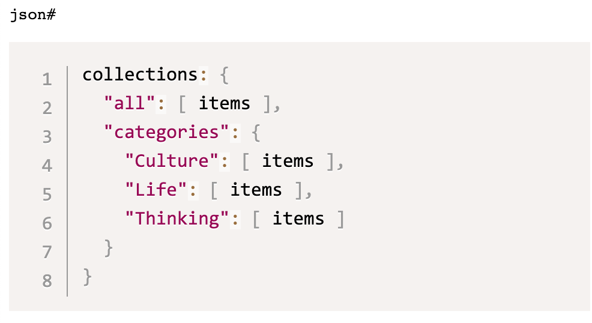
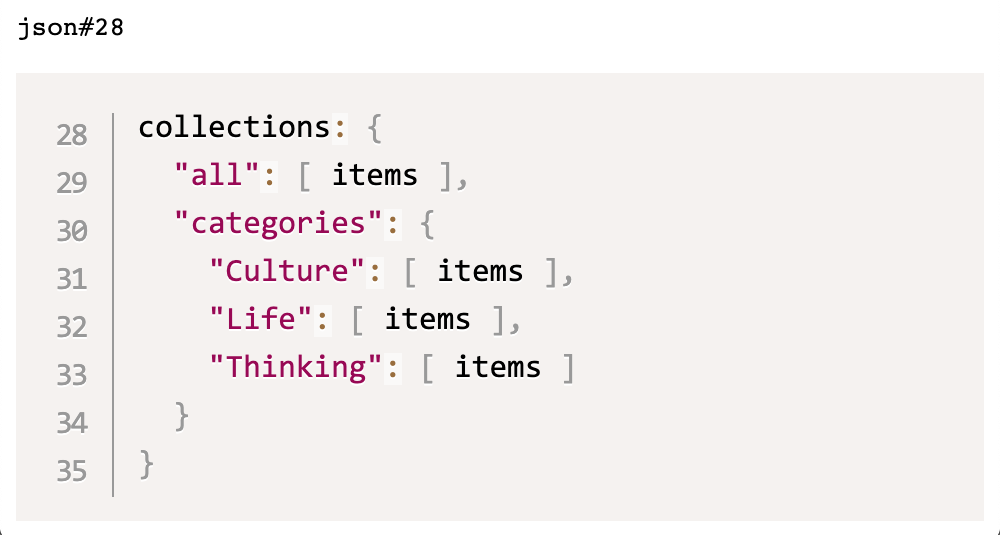

# eleventy-md-syntax-highlight

PrismJS
markdown
syntax highlighting
with optional line numbers
for Eleventy.

<!-- START doctoc generated TOC please keep comment here to allow auto update -->
<!-- DON'T EDIT THIS SECTION, INSTEAD RE-RUN doctoc TO UPDATE -->
<details>
<summary>**Contents**</summary>

- [Installation](#installation)
- [Configuration](#configuration)
- [Styles](#styles)
- [Markup](#markup)
- [Credits](#credits)
</details>
<!-- END doctoc generated TOC please keep comment here to allow auto update -->


The differences between the
[official syntax highlighting plugin][official-syntaxhighlight]
and this plugin are:

- Handles only Markdown code fences
- Provides optional line numbers
- Does not highlight lines


## Installation

``` text
npm i @pborenstein/eleventy-md-syntax-highlight --save-dev
```

## Configuration

In your Eleventy configuration file
(typically `.eleventy.js`)
install the plugin like this.


```js
const syntaxHighlight = require('eleventy-md-syntax-highlight')

module.exports = function(eleventyConfig) {
  eleventyConfig.addPlugin(syntaxHighlight,
    { showLineNumbers: false })
}
```

| When `showLineNumbers` is… | This is what happens…                                                                                                                                             |
| :------------------------- | :---------------------------------------------------------------------------------------------------------------------------------------------------------------- |
| `false`<br>(default)       | Code fences do not have line numbers by default.<br><br> You can enable line numbers for a specific code fence by appending a hash mark (`#`) after the language. |
| `true`                     | Every code fence has line numbers. You cannot disable line numbers for a specific code fence.                                                                     |


## Styles

This plugin uses unedited PrismJS CSS files.
You can get the CSS two ways:

**A:** Download the CSS from the PrismJS site

1.  Go to the PrismJS [downloads page][prismjs-downloads].
1.  Select a [PrismJS theme][prismjs-downloads-themes].
2.  Select the [Line Numbers plugin][prismjs-downloads-plugins].
3.  Click the **Download CSS** button to download a single CSS
    file that contains the theme and the line number
    styles. (You don't need the JS files.)

**B:** Get the files from the [PrismJS repo][].

1.   Get a [theme CSS file]()
2.   Get the line numbers CSS file [`prism-line-numbers.css`][prism-line-numbers.css]


## Markup

This is how you mark up code fences.

If `showLineNumbers` is `false`, append a
hash mark (`#`) to the language.

~~~
```json#
collections: {
  "all": [ items ],
  "categories": {
    "Culture": [ items ],
    "Life": [ items ],
    "Thinking": [ items ]
  }
}
```
~~~

Which will render like this:



To start with a specific line number,
add it after the hash mark (`#`).
The line numbers for this code fence
will start st 28:

~~~
```json#28
collections: {
  "all": [ items ],
  "categories": {
    "Culture": [ items ],
    "Life": [ items ],
    "Thinking": [ items ]
  }
}
```
~~~

As you can see here:



## Credits

- Zach Leatherman (@zachleat): [official Eleventy plugin][official-syntaxhighlight]
- Anders Grendstadbakk (@andeersg): [How to do it](https://github.com/11ty/eleventy-plugin-syntaxhighlight/pull/14)


[official-syntaxhighlight]:   https://www.11ty.dev/docs/plugins/syntaxhighlight/
[prismjs-downloads]:          https://prismjs.com/download.html
[prismjs-downloads-themes]:   https://prismjs.com/download.html#category-themes
[prismjs-downloads-plugins]:  https://prismjs.com/download.html#category-plugins
[PrismJS repo]:               https://github.com/PrismJS/prism/
[prism-themes]:               https://github.com/PrismJS/prism/tree/master/themes
[prism-line-numbers.css]:     https://github.com/PrismJS/prism/tree/master/plugins/line-numbers


